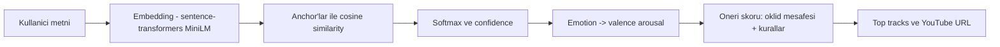
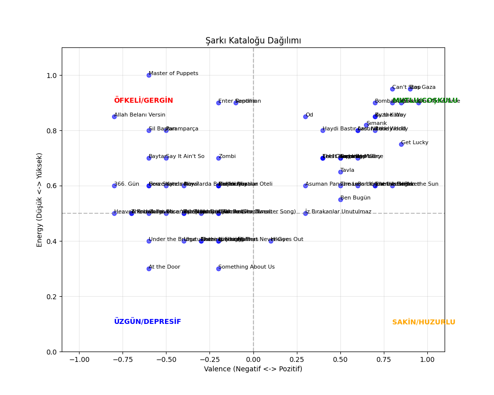

# Duygu AI

Duygu AI, React tabanlı bir frontend ve FastAPI tabanlı bir backend kullanan, uçtan uca bir yapay zeka sohbet uygulaması örneğidir. Amaç; modern bir UI ile API tabanlı bir AI servisinin entegrasyonunu göstermektir.

## 🚀 Özellikler

- 💬 Gerçek zamanlıya yakın sohbet arayüzü
- 🎨 Modern ve responsive arayüz (desktop & mobile)
- 🤖 Backend üzerinden AI destekli cevap üretimi
- ⚡ Hızlı geliştirme ortamı (Vite + FastAPI + Uvicorn)
- 📡 HTTP API üzerinden ayrık frontend/backend mimarisi

## 🧱 Mimari Genel Bakış

- Frontend, tarayıcıda çalışan tek sayfa uygulamasıdır (SPA).
- Backend, JSON tabanlı HTTP API sağlar (FastAPI).
- Frontend, kullanıcı mesajlarını backend'e gönderir; backend bu mesajları işler ve AI cevabını geri döndürür.
- Geliştirme sırasında servisler ayrı portlarda çalışır:
   - Backend: `http://localhost:8000`
   - Frontend: `http://localhost:5173`

## 🧠 Nasıl Calisir? (Architecture & Logic)
Duygu-AI, basit bir if/else kural seti veya kelime eslesmesi (keyword matching) ile calismaz. Bunun yerine modern NLP (Dogal Dil Isleme) teknikleriyle metni vektor uzayinda temsil eder ve benzerlik/mesafe hesaplariyla duygu + muzik onerisi uretir.

Sistem 3 ana asamadan olusur:

> Akisin tamami (ozet):



> Not: `/analyze` endpoint'i `{ data, error }` envelope dondurur; rate limit durumunda `error.code = RATE_LIMITED` gelebilir.

### 1) Anlamsal Analiz (Semantic Analysis)
Kullanicidan gelen metin (orn. "Bugun isler cok yogundu, pilim bitti"), `sentence-transformers` ile gorece kucuk ve hizli bir model kullanilarak sayisal bir vektore (embedding) donusturulur. Bu projede varsayilan model `paraphrase-multilingual-MiniLM-L12-v2` olup pratikte 384 boyutlu embedding uretir.

Ardindan sistem, onceden tanimlanmis 5 temel duygu "capasi" (anchor) ile karsilastirir:
- Happy
- Sad
- Calm
- Energetic
- Lonely

Karsilastirma, Cosine Similarity (KosinUs benzerligi) uzerinden yapilir. Boylece kelimeler birebir ortusmese bile (orn. "pilim bitti" vs "yorgunum"), model **anlamsal yakinligi** yakalayabilir.

Ek olarak, skorlar Softmax ile olasiliga cevrilir ve en yuksek olasilik **confidence** olarak kullanilir (modelin "ne kadar emin" oldugu).

> Guvenlik/robustness: Metin asiri tekrarliysa (orn. tek karakter spam), backend analiz sonucu `neutral` dondurerek sistemi daha kararlı tutar.

### 2) Duygu Haritalama (Valence - Arousal Model)
Bulunan duygu, muzik psikolojisinde sik kullanilan Valence/Arousal duzlemindeki hedef bir noktaya cevrilir:
- **Valence (X):** duygunun ne kadar pozitif/negatif oldugu
- **Arousal (Y):** duygunun ne kadar enerjik/sakin oldugu

Basit bir sezgisel gorsellestirme:

```text
Energy (Arousal) ^
                 |   Ofkeli/Gergin (-V, +A)   |   Mutlu/Coskulu (+V, +A)
                 |----------------------------+----------------------------> Valence
                 |   Uzgun/Depresif (-V, -A)  |   Sakin/Huzurlu (+V, -A)
                 |
```

> Russell's Circumplex Model (Valence vs Arousal):


> Ornek (projede kullanilan mapping): `calm -> valence: 0.2, arousal: 0.2` (degerler kolayca ayarlanabilir).

> Not: Bu yaklasim Russell's Circumplex Model fikrinden ilham alir; amac duyguyu 2 boyutlu bir koordinata indirip oneriyi sayisallastirmaktir.

### 3) Akilli Oneri Algoritmasi (Recommendation Engine)
Hedef (valence, arousal) belirlendikten sonra sarki katalogundaki her parca icin temel benzerlik skoru hesaplanir:
- Sarkinin (valence, energy) noktasi ile hedef nokta arasindaki **Oklid mesafesi** bulunur
- Mesafe, `1 / (1 + distance)` ile 0-1 araligina yaklastirilarak "similarity" elde edilir

Sonra sadece mesafe ile yetinmeyip su akilli kurallar uygulanir:
- **Tempo Uyumu (Tempo Matching):** kullanici enerjisi yuksekse `high` tempo bonus, `low` tempo ceza (dusuk enerjide tersine)
- **Duygu Tutarliligi (Mood Consistency):** kullanici cok pozitifken cok negatif sarkilar (ve tersi) cezalandirilir
- **Cesitlilik (Diversity):** ayni sanatcidan en fazla 1, ayni turden en fazla 2 parca secilerek liste dengelenir

Cikti olarak frontend, onerilen parcalardaki `youtube_url` alanini bir "play" kisayolu olarak gosterir.

### 💡 Neden LLM (GPT) degil de MiniLM? (Opsiyonel)
Bu proje icin hedef; dusuk gecikme (low latency) ve dusuk kaynak tuketimi. Sadece "anlamsal yakinligi" yakalamak icin buyuk bir LLM calistirmak yerine, bu is icin optimize edilmis daha kucuk bir sentence embedding modeliyle CPU uzerinde hizli inference yapilabilir.

Istersen ayrica Russell's Circumplex Model icin bir gorsel ekleyebilirsin (orn. kendi cizdigin veya lisansi uygun bir gorsel). Bu README’de ise telif riski olmamasi icin metin + diyagram ile anlatimi tuttum.

## 📦 Kurulum ve Çalıştırma

Aşağıdaki adımlar proje kök dizininde (`duygu-ai/`) çalıştırılmak üzere tasarlanmıştır.

### 1. Backend Kurulumu

1. Backend dizinine geçin:

```bash
cd backend
```

2. Sanal ortam oluşturun ve aktifleştirin:

```bash
python -m venv venv
source venv/bin/activate  # Windows: venv\Scripts\activate
```

3. Python bağımlılıklarını yükleyin:

```bash
pip install -r requirements.txt
```

4. Backend sunucusunu başlatın:

```bash
python main.py
# veya proje içinde tanımlı ise:
# uvicorn main:app --reload --host 0.0.0.0 --port 8000
```

Backend API şu adreste çalışıyor olacaktır: `http://localhost:8000`.

### 2. Frontend Kurulumu

1. Yeni bir terminal açın ve proje köküne dönün, ardından frontend dizinine geçin:

```bash
cd frontend
```

2. Node bağımlılıklarını yükleyin:

```bash
npm install
```

3. Geliştirme sunucusunu çalıştırın:

```bash
npm run dev
```

Frontend geliştirme sunucusu şu adreste çalışıyor olacaktır: `http://localhost:5173`.

## 🎯 Kullanım

1. Backend'i `http://localhost:8000` üzerinde çalışır halde tutun.
2. Frontend geliştirme sunucusunu `http://localhost:5173` üzerinde başlatın.
3. Tarayıcınızdan `http://localhost:5173` adresine gidin.
4. Mesajınızı yazıp gönderin; yanıtlar backend üzerinden AI modeli/servisinden alınır.

## ⚙️ Yapılandırma ve Ortam Değişkenleri

Backend ve frontend tarafında, kullanmak istediğiniz AI servislerine göre bazı ortam değişkenleri gerekebilir (ör. bir LLM API anahtarı, base URL vb.).

Örnek yaklaşım (öneri):

- Backend: `.env` dosyasında

   - `AI_API_KEY=...`
   - `AI_API_BASE_URL=...`

- Frontend: `.env` dosyasında

   - `VITE_API_BASE_URL=http://localhost:8000`

Gerçek projede kullandığınız değişkenleri backend ve frontend README dosyalarında daha detaylı tanımlayabilirsiniz.

## 📚 API Dokümantasyonu

Backend çalışır durumda iken aşağıdaki uç noktalardan otomatik üretilen API dokümantasyonuna erişebilirsiniz:

- Swagger UI: `http://localhost:8000/docs`
- ReDoc: `http://localhost:8000/redoc`

Sohbet uç noktaları (endpoint) ve istek/yanıt şemaları burada ayrıntılı olarak görüntülenebilir.

## 🔌 Backend API Endpoints

Backend, FastAPI ile JSON tabanlı HTTP API sağlar.

- `POST /analyze` — Metinden duygu analizi (valence/arousal/emotion)
- `POST /recommend` — Valence/arousal değerlerine göre şarkı önerisi

### `POST /analyze`

Kullanıcı metnini analiz eder ve `data` alanında sonuç döner. Rate limit durumunda `error` dolu gelebilir.

```json
{
  "text": "Bugün kendimi çok mutlu hissediyorum!"
}
```

```json
{
  "data": {
    "valence": 0.8,
    "arousal": 0.6,
    "emotion": "happy",
    "confidence": 0.3,
    "provider": "local",
    "timestamp": "2026-02-10T12:34:56Z"
  },
  "error": null
}
```

### `POST /recommend`

Valence/arousal değerlerine göre `tracks` listesi döndürür. Varsayılan olarak 5 öneri üretir.

```json
{
  "valence": 0.8,
  "arousal": 0.6
}
```

```json
{
  "tracks": [
    {
      "title": "Bas Gaza",
      "artist": "İsmail YK",
      "score": 0.92,
      "youtube_url": "https://www.youtube.com/results?search_query=..."
    }
  ],
  "timestamp": "2026-02-10T12:34:56.000Z"
}
```

## 🎵 Recommendation Engine (Backend)

Öneri motoru, `backend/recommender.py` içindeki `RecommendationEngine` sınıfıdır.

**Katalog yükleme**

- Sunucu açılışında `data/songs.json` belleğe alınır (`settings.songs_path`).
- `tempo` alanı yoksa varsayılan `medium` kabul edilir.

**Temel skor (Öklid mesafesi)**

- Her şarkı için (valence, energy) ile hedef (target_valence, target_arousal) arasındaki mesafe hesaplanır.
- Skor: `score = 1 / (1 + distance)`

**Kural tabanlı düzeltmeler**

- Mood consistency: hedef çok pozitifken çok negatif şarkılar ve hedef çok negatifken çok neşeli şarkılar cezalandırılır.
- Tempo matching: arousal yüksekse `high` tempo bonus, `low` tempo ceza; arousal düşükse tersine.

**Çeşitlilik (diversity)**

- En iyi ilk 30 aday arasından seçim yapılır.
- Sanatçı başına en fazla 1 şarkı, tür başına en fazla 2 şarkı.
- Liste dolmazsa kalan adaylardan tamamlanır.

## 🎶 Şarkı Kataloğu

> Bu katalogtaki şarkıları, projeyi geliştirirken genel olarak **kişisel favori türlerimden** (Pop, Rock, Indie Rock, Metal, Rap, Electronic/Disco vb.) örnekler olacak şekilde seçtim. Amaç; farklı "mood" noktalarına düşen çeşitli bir havuz oluşturup öneri motorunun davranışını görünür kılmaktı.

### Katalog görselleştirmesi
Aşağıdaki grafik, katalogdaki parçaların **valence (negatif↔pozitif)** ve **energy (düşük↔yüksek)** uzayındaki dağılımını gösterir. Bu dağılım sayesinde öneri motoru, kullanıcının hedef duygu durumuna yakın şarkıları daha yüksek skorla seçebilir.



> Not: Grafikteki dört bölge (ör. mutlu/coşkulu, sakin/huzurlu, üzgün/depresif, öfkeli/gergin) şarkıların yaklaşık duygu karşılıklarını görsel olarak ayırt etmeye yardımcı olur.

### `songs.json` alanları
Katalog dosyası [backend/data/songs.json](backend/data/songs.json) içinde tutulur. Her şarkı objesi şu alanları içerir:

- `id`: Katalog içi benzersiz kimlik
- `title`: Şarkı adı
- `artist`: Sanatçı adı
- `genre`: Tür etiketi (çeşitlilik kuralları için kullanılır)
- `valence`: Duygu kutbu ($-1$ negatif, $+1$ pozitif)
- `energy`: Enerji seviyesi ($0$ düşük, $1$ yüksek)
- `tempo`: Basit tempo etiketi (`low` | `medium` | `high`)
- `youtube_url`: YouTube arama linki (UI tarafında "play" kısayolu olarak kullanılır)

> Katalog değerleri *örnek/heuristic* amaçlıdır; gerçek bir müzik datasetiyle değiştirildiğinde aynı alanlar üzerinden daha güvenilir öneriler üretilebilir.

## 🏗️ Proje Dizini

```ini
duygu-ai/
├── backend/
│   ├── main.py           # FastAPI uygulaması, API uç noktaları
│   ├── requirements.txt  # Python bağımlılıkları
│   └── data/             # Şarkı kataloğu (songs.json)
├── frontend/
│   ├── src/              # React uygulama kaynak kodu
│   ├── package.json      # Node bağımlılıkları ve script'ler
│   └── vite.config.js    # Vite yapılandırması
└── README.md             # Projenin tek dokümantasyonu (frontend+backend)
```

## 🧪 Geliştirme ve Test

- Backend için isteğe bağlı olarak pytest veya FastAPI test araçları ile testler ekleyebilirsiniz.
- Frontend için React Testing Library veya Vitest/Jest kullanılabilir.
- Lint araçları (ör. `flake8`, `black`, `eslint`, `prettier`) entegre edilerek kod kalitesi artırılabilir.

## 🚢 Dağıtım (Deployment)

Projeyi production ortamına almak için tipik yaklaşımlar:

- Backend için:

   - Uvicorn/Gunicorn ile FastAPI uygulamasını bir reverse proxy (NGINX vb.) arkasında çalıştırmak

- Frontend için:

   - `npm run build` ile statik dosyaları üretmek
   - Üretilen build çıktısını bir statik dosya sunucusunda (NGINX, CDN, vb.) barındırmak

Detaylı deployment adımlarını kendi hedef ortamınıza göre backend ve frontend README dosyalarında özelleştirebilirsiniz.

## 🤝 Katkıda Bulunma

Katkılarınızı memnuniyetle karşılıyoruz. Önerilen süreç:

1. Bir issue açarak geliştirme/iyileştirme fikrinizi tartışın.
2. Yeni bir branch açın (örn. `feature/improve-ui`, `fix/api-timeout`).
3. Değişiklikleri yapın ve uygun ise testleri ekleyin/güncelleyin.
4. Açıklayıcı bir açıklama ile pull request gönderin.

## 📝 Lisans

Bu proje MIT lisansı ile lisanslanmıştır. Ayrıntılar için `LICENSE` dosyasına veya alt projelerde belirtilen lisans bilgilerine bakabilirsiniz.
